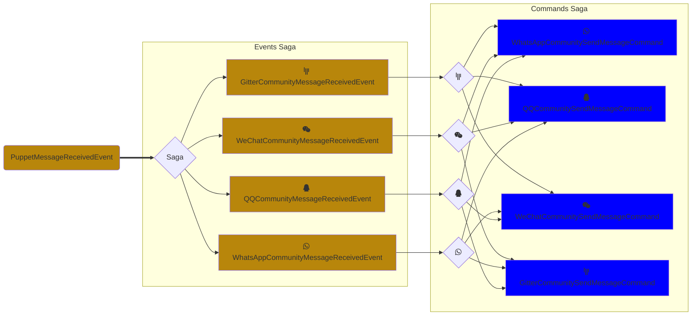
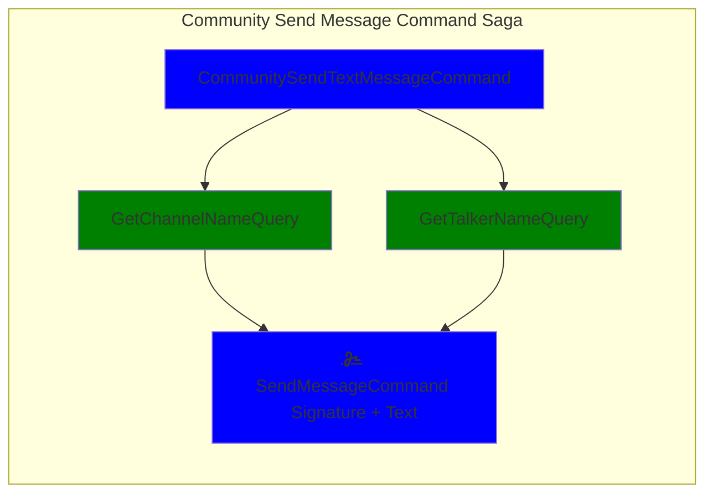
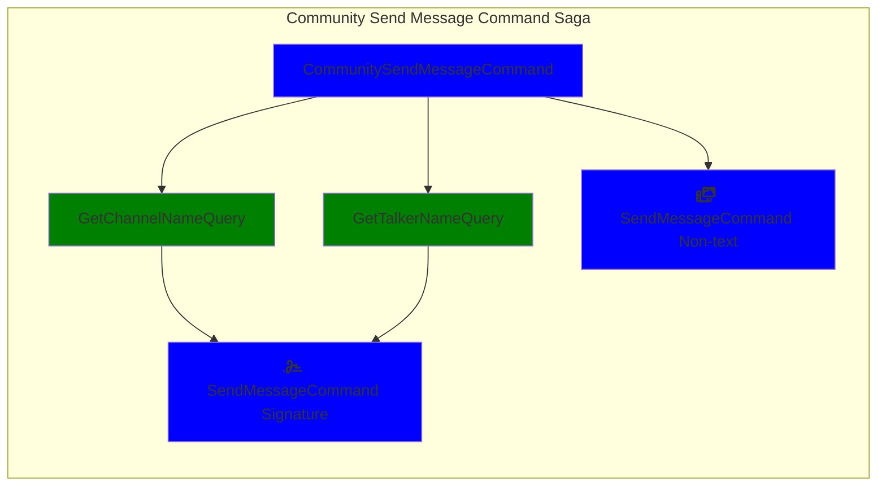
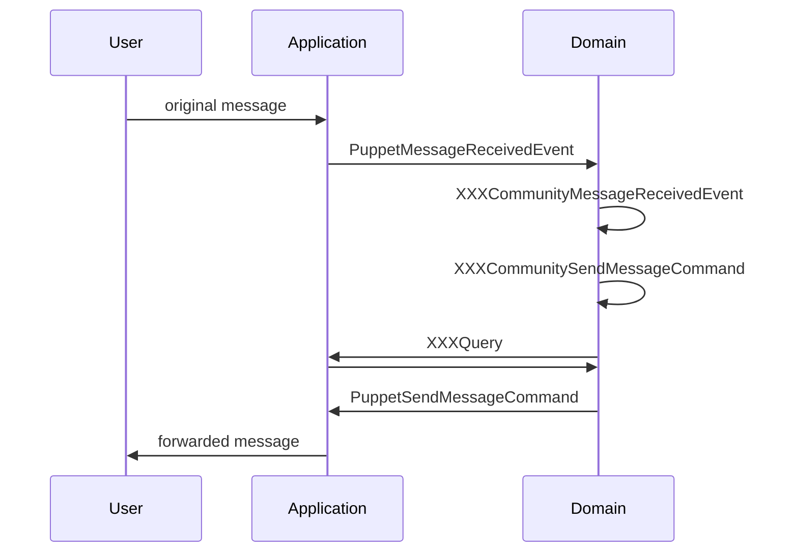

## Friday BOT DDD & CQRS

Friday BOT is using the below design patterns:

1. Domain-driven Design (DDD)
1. Command Query Responsibility Segregation

## Sub Domain: Sync Community Rooms

Sync messages between community rooms from different IM platforms.

## Saga Diagram

**Saga** is a program pipeline to react a specific Domain Event/Command by producing new Events/Commands to implement the business logic.

### Domain Saga: Event to Command

## Command Saga: Domain to Application

### Text Message

## Non-text Message

## Application & Domain

